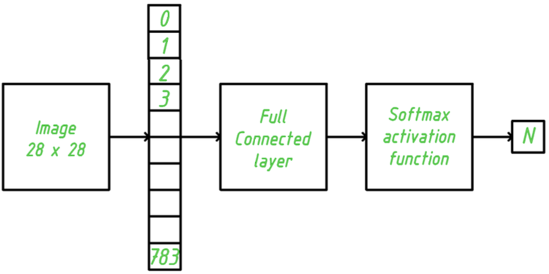
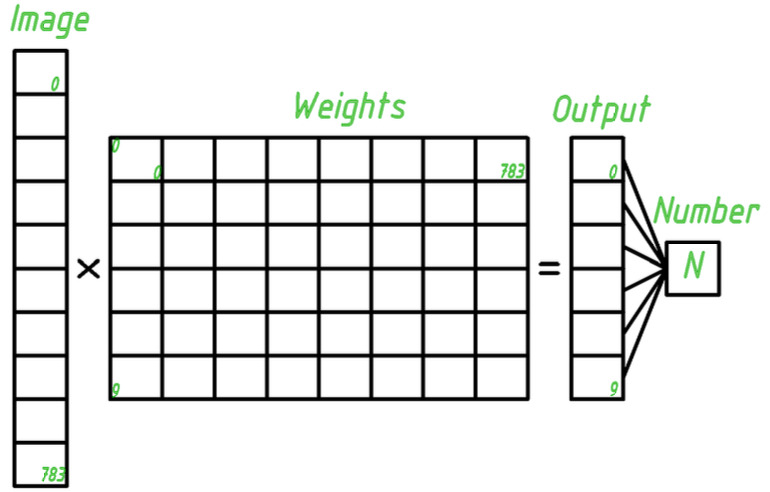
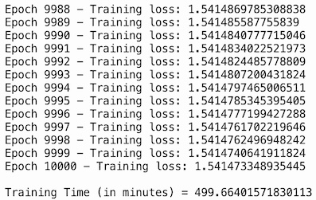
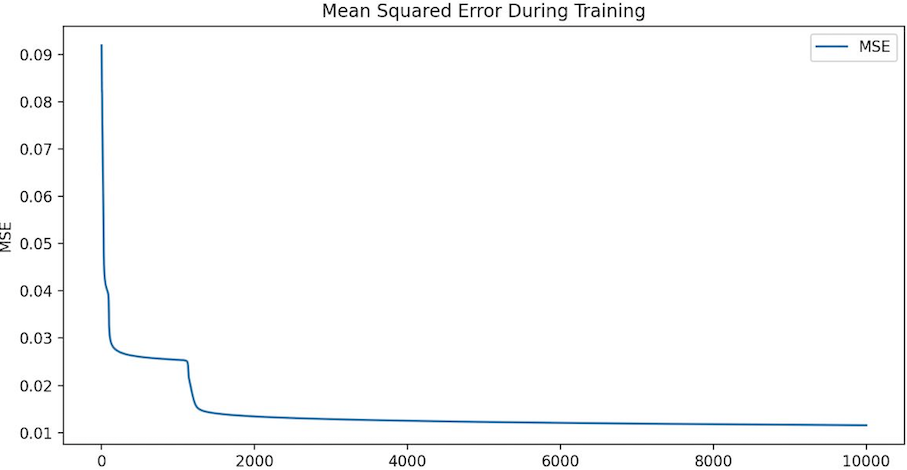
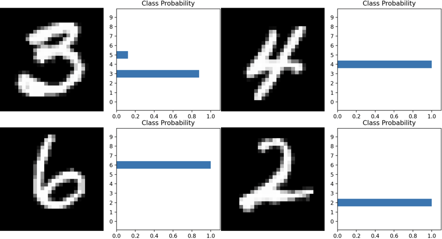
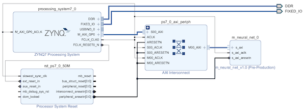
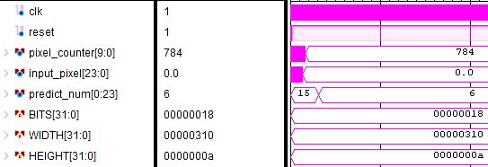
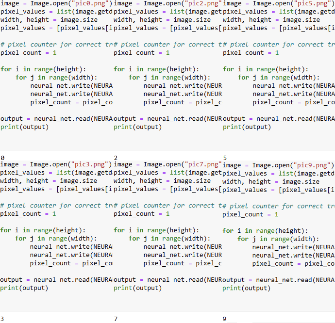

    Neural Network to Recognize Handwritten Digits

In this repository locate a project that describe in Python Neural Network to recognize handwritten digits using PyTorch library.

It's a neural net with one full connected layer and softmax activation function.

Structure of neural net:

The input is 784 = 28 $\cdot$ 28 neurons, each connected to one of each image. On the final layer with 10 neurons, one per digit. Accordingly, each of the 10 outputs takes the form of a linear combination of 784 inputs:

$$y_i = \sum_{j = 0}^{783} w_{ij}\cdot x_j + b_i, $$

where $w_{ij}$ - weight coefficient, $x_j$ - current pixel, $b_i$ - accumulated amount, $i = \overline{0, 9}$.

Thus, the model has 784 · 10 + 10 = 7850 parameters that need to be trained.

To implement a neural network in hardware, you must first train the network in a software environment. In this case, the Python programming language and the PyTorch library are used. To test a neural network in a hardware environment, use Xilinx Zynq platform.

The process of operation of a neural network begins with data transfer to a module implemented on programmable logic using the PYNQ distribution kit and the AXILite interface. The initial data processing, including reading the image, is carried out in Python. This image is then converted into the required format and transferred via the AXILite interface to the programmable logic. As part of the implementation of the neural network, the Q12.12 number representation format is used. The Q12.12 format refers to a fixed point, where a number is represented as an integer and a fractional part, each of which occupies 12 bits.

A way to represent each pixel in an image:

In programmable logic, data enters the fully connected layer module, where the weighted sum of the input signals is calculated.

The output values ​​of the fully connected layer are processed by the softmax activation function, which converts them into a probability distribution. As a result, the most probable value of the digit recognized in the image is sent to the output.

This probability value is then transmitted back to the processor system via the AXILite interface. The processor system processes the received data and displays the result on the screen, providing the user with the final output - the recognized digit.

The operation of this neural network model:

Thus, the project can be reduced to the implementation of a matrix multiplier and search for the maximum element of the array. 

The neural network was trained on the MNIST dataset, which consists of 10,000 training images of numbers from 0 to 9. To train the neural network, the SGD optimizer was used with a learning coefficient of 0.003 and a momentum of 0.9. Training took place over 10,000 epochs. 

During the training process, the mean square error (MSE) between the model output and the true labels was also calculated, which allowed tracking
live the degree of convergence of the model to the correct answers.

Neural network training results:

MSE:

Examples of the operation of this neural network on a test set of images are presented:

To implement a neural network module based on the Xilinx ZYNQ platform. You need to create a block diagram. To do this, you need to create an IP core of a self-written block. Data transfer is carried out via the AXILite interface, packaged in the uP interface.

The central element of the IP block is the fully connected layer, developed on the basis of ten MAC cores. These cores enable parallel processing of each pixel of the input image. Each core multiplies the matrix of input values ​​by a matrix of weighting coefficients that are pre-loaded into the device memory. The result is an array of ten elements representing the layer's output. 

The output array of the fully connected layer goes to the input of the activation function which, in order to reduce the computational load, instead of completely converting it into a probability distribution, the index of the element with the largest value is selected.

Зroject block diagram:

Initially, the system was tested in simulation mode. Images were prepared and fed into the neural network input in test mode.

Network testing result:

Further testing was carried out using the Xilinx PYNQ platform. This device has been tested on various input sets.

Results of testing a device on the Xilinx ZYNQ platform:

